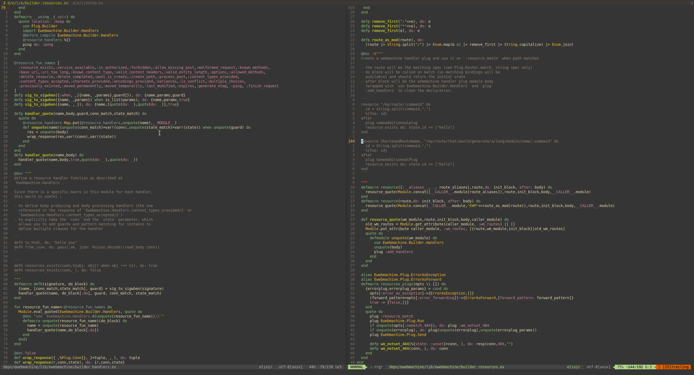

I have been using Vim/Neovim as my primary IDE for the last 5 years and developing in Elixir for the past 2 years and a half or so. In this article, I'll try to explain my current setup with its plugin and global configuration. I'll also include as many tips as possible so that you can boost your productivity using this fantastic editor. **This article is aimed at Neovim users but you can adapt everything to vim.**

## Plugin manager

First of all, we need a plugin manager because downloading manually every time you need to use vim on a new session becomes annoying pretty quickly. I personnaly use vim-plug but Pathogen or other choices are ok too !

I like to have my plugs separated from the rest of my config so put

```vim
source $HOME/.config/nvim/plug.vim
```

at the top of your `init.vim` file.

In your `plug.vim` file, copy the following to install plug-vim if absent.

```vim
let vimplug_exists=expand('~/.config/nvim/autoload/plug.vim')

if !filereadable(vimplug_exists)
  if !executable("curl")
    echoerr "You have to install curl or first install vim-plug yourself!"
    execute "q!"
  endif
  echo "Installing Vim-Plug..."
  echo ""
  silent exec "!\curl -fLo " . vimplug_exists . " --create-dirs https://raw.githubusercontent.com/junegunn/vim-plug/master/plug.vim"
  let g:not_finish_vimplug = "yes"

  autocmd VimEnter * PlugInstall
endif
```

To download and use plugins, we need to add the following to `plug.vim` :

```vim
call plug#begin('~/.config/nvim/plugged')
Plug 'tpope/vim-fugitive'
call plug#end()
```

The line `Plug 'tpope/vim-fugitive'` is an example of a plugin you can install. You need to put the keyword `Plug` followed by the plugin's github repository.

With this, we have the plugin manager and we can dive into the exciting parts !

## The basics

I'll try to not spend too much time on these but we still need to use a few basic plugins for project management and other purposes. Here is the list :

```vim
  Plug 'tpope/vim-surround'
  Plug 'scrooloose/nerdtree'
  Plug 'Xuyuanp/nerdtree-git-plugin'
  Plug 'scrooloose/nerdcommenter'
  Plug 'tpope/vim-fugitive'
  Plug 'jiangmiao/auto-pairs'
  Plug 'bling/vim-airline'
  Plug 'nathanaelkane/vim-indent-guides'
```

In order, these will:

- Change the characters surrounding an object (line/word/paragraph/other)
- Display a file explorer of the current directory
- Add git functionnalities to the previous file explorer
- Comment/uncomment more easily
- Add git functionnalities such as git vertical diff to resolve merge conflicts with ease
- Autopairs certain non alphanumerical characters such as parenthesis, quotes, curly braces ...
- Display a status/tabline
- Display indent guides

For the configuration, here are a few very basics config parameters :

```vim
"" Encoding
set encoding=utf-8
set fileencoding=utf-8
set fileencodings=utf-8

" Basic stuff
let mapleader=","
set foldmethod=indent

"" Tabs. May be overridden by autocmd rules
set tabstop=2
set softtabstop=0
set shiftwidth=2
set expandtab

"" Fix backspace indent
set backspace=indent,eol,start

"" Enable hidden buffers
set hidden

"" Searching
set nohlsearch
set incsearch
set ignorecase
set smartcase

" session management
let g:session_directory = "~/.config/nvim/session"
let g:session_autoload = "no"
let g:session_autosave = "no"
let g:session_command_aliases = 1
set nobackup
set noswapfile

set nocompatible
```

There is a million other settings that you can tweak but for now, it will be enough !

You might also want to add a theme of your choice such as nord/gruvbox/dracula...

## Syntax Highlighting

For syntax highlighting, I use `vim-elixir` so add the following in your `plug.vim` file:

```vim
Plug 'vim-editors/vim-elixir'
```

It also handles automatic indentation which is always handy. You must have the following in your `init.vim` file for it to work properly:

```vim
syntax on
filetype plugin indent on
```

## Snippets

Snippets are small templates for commonly used code that you can fill in on the fly. It's surprisingly powerful and doesn't need much configuration.

First, we need a plugin to handle snippets. I like to use Ultisnips to manage them.
Add to your `plug.vim` file:

```vim
Plug 'sirver/ultisnips'
Plug 'honza/vim-snippets'
```

And to your `init.vim`:

```vim
" Snippets
let g:UltiSnipsExpandTrigger="<c-j>"
let g:UltiSnipsJumpForwardTrigger="<c-j>"
let g:UltiSnipsJumpBackwardTrigger="<c-b>"
```

For example, I can just type `mod` and press `ctrl + j` and it will complete it to

```elixir
defmodule name do
end
```

with the cursor on `name` and `name` selected so I can just keep on typing to change to name of the module.

There is a lot of other snippets ready to be used. If you want to consult them or edit them, type `:UltiSnipsEdit` with an elixir file opened.

## Tags and autocompletion

Tags are very powerful and helps you navigate big projects with more fluidity. Autocompletion is also a pretty basic feature for any IDE which respects itself.  
The plugin I use is alchemist and it's fantastic! The only downside I have with it is I can't seem to jump to the definition of a module or function in a new tab. For your `plug.vim` file:

```vim
  Plug 'slashmili/alchemist.vim'
  Plug 'Shougo/deoplete.nvim', { 'do': ':UpdateRemotePlugins' }
```

And for your `init.vim` file:

```vim
" Deoplete config
let g:deoplete#enable_at_startup=1
call deoplete#custom#option('ignore_sources', {'_': ['around', 'buffer']})
```

To jump to the definition of the function/module/macro your cursor is on, just press `ctrl + ]`. If you want to come back to where you were before, press `ctrl + t`. It requires to have your project compiled whether with `iex -S mix` or `mix phoenix.server`.
For autocompletion, just press `ctrl + x` followed by `ctrl + o` to open a contextual menu with the different options.

## Conclusion

Vim is a very powerful editor and with only a few plugins, you can make it usable even for big projets while retaining its speed and lightweight.  
If you want to see the rest of my configuration, head over to [my dotfiles](https://github.com/cvignal/dotfiles) !
