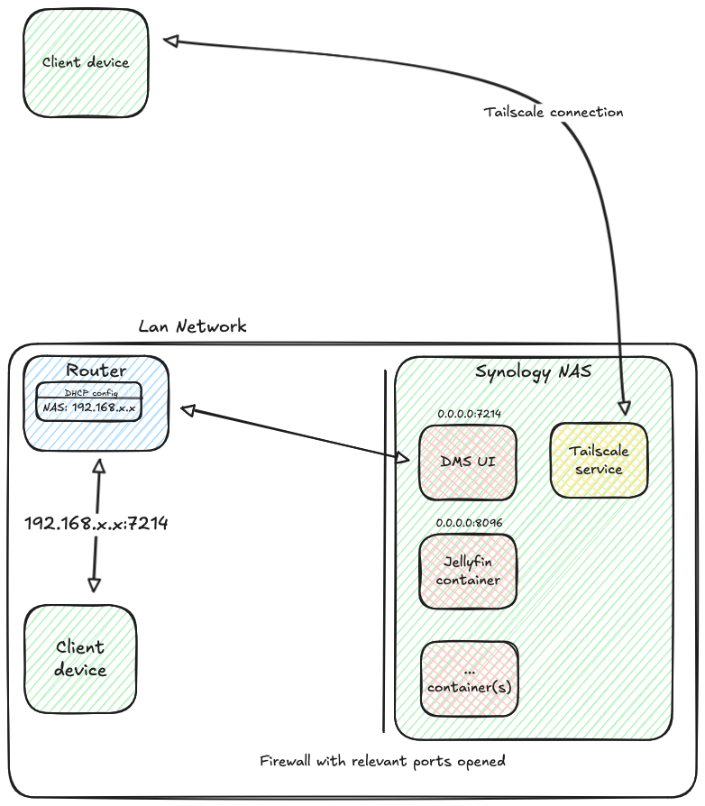
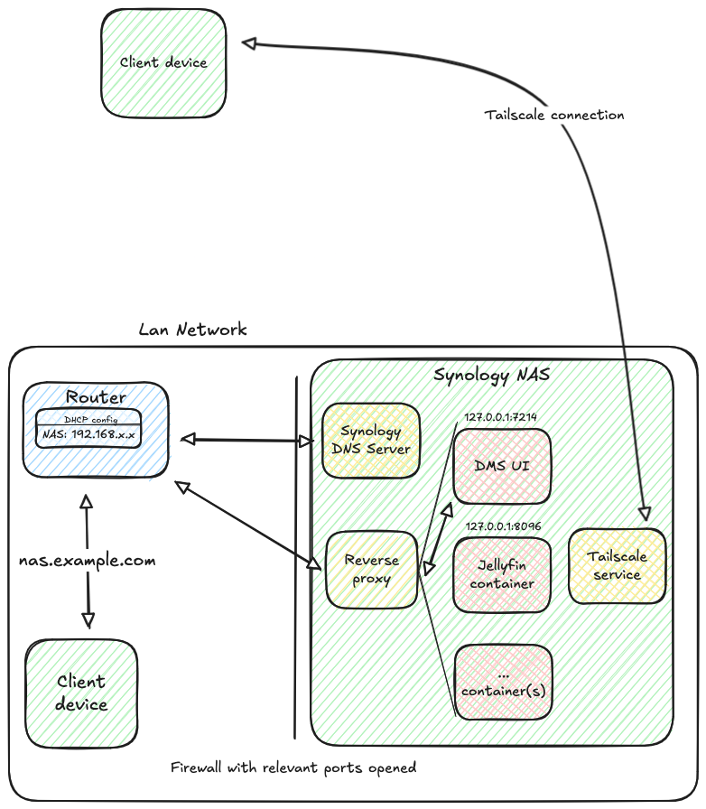
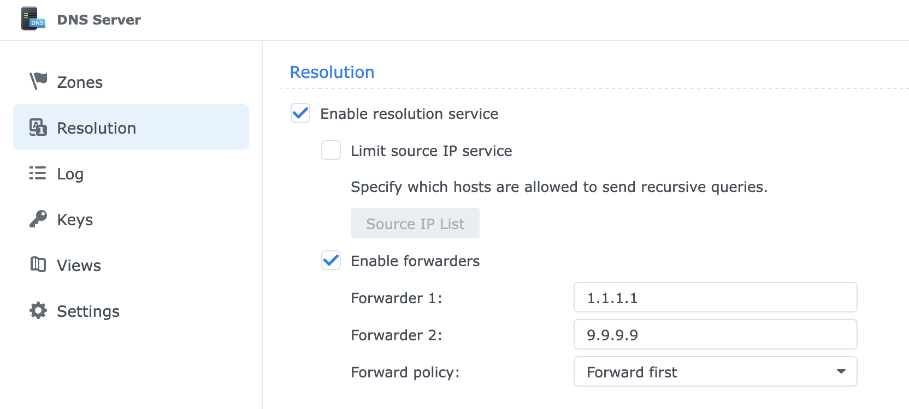
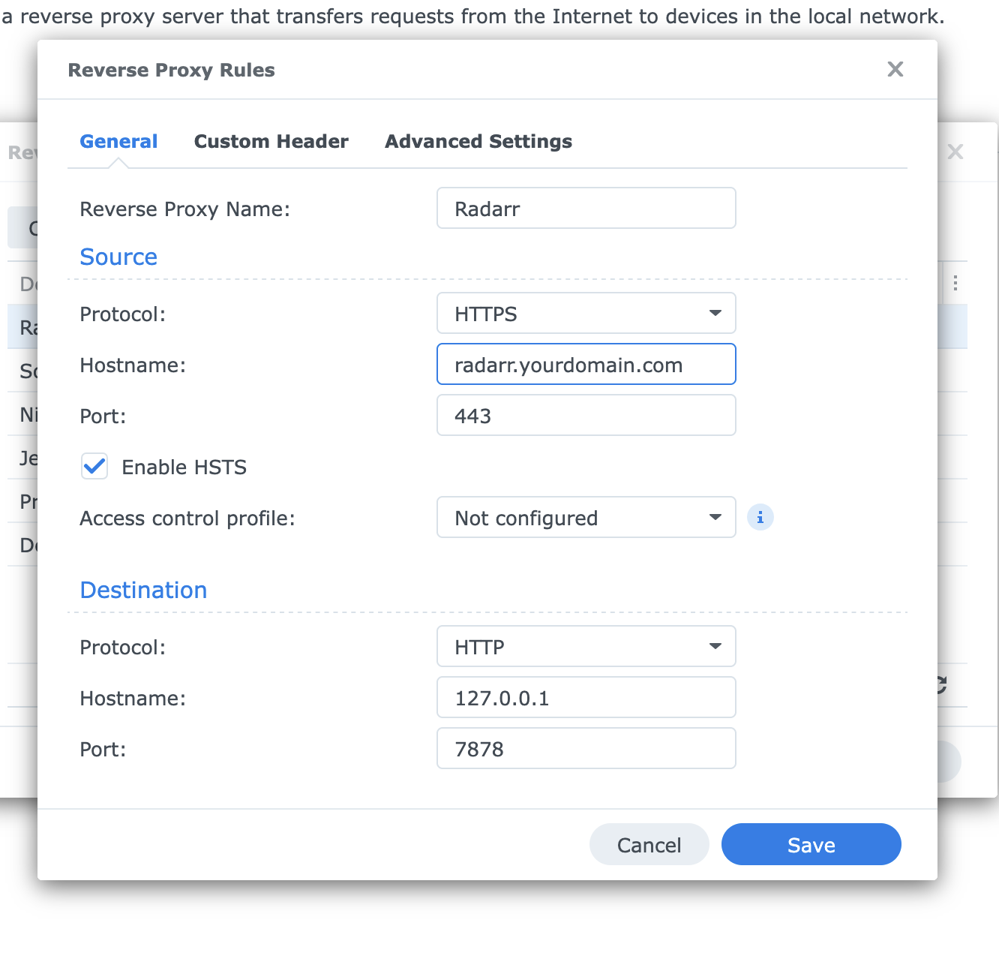

As we all know, network is fun! And what's even funnier in networking you may wonder? [DNS](https://isitdns.com/) of course!

In the past few weeks, I've been changing my LAN network config, starting from [DrFrankenstein excellent guides](https://drfrankenstein.co.uk/) and trying to achieve the following:

1. Accessing all my services through a FQDN and not an IP anymore. I've recently moved out, my ISP changed and my router did meaning I couldn't assign the same static IP to my NAS so I had to change all of my config manually in multiple places, it was a pain
2. Accessing all my services through HTTPS with trusted certificates. I have other users on my network and installing root certificates on all their devices was not an option.

As usual when messing with this kind of work, I found myself repeatedly bashing my head against the wall (the wall being nslookup/dig/scutil/any network tool available) for quite a while so I figured I'd write a blog post about it if it can help someone in the future.

## Previous setup

Without going through all the details, this is what the previous setup looked liked:

Each service was accessed throught the NAS static IP (setup at the router level) with its port allowed in the firewall. When outside the LAN, we used Tailscale to access the local network, using [subnets](https://tailscale.com/kb/1019/subnets).
There were some issues:

- Lots of ports opened in the firewall configuration
- If the static IP couldn't be attributed anymore (my new router for example), all the config had to be updated manually (docker config, bookmarks, application configurations ...)
- No HTTPS
- Not using FQDN is confusing for non technical users who wouldn't remember/bookmark each service with is port.

## New setup


The two new components are both native Synology tools and can easily be replaced by opensource tools of your choice: the DNS server and the reverse proxy.

Let's go through the basic flow:

1. A client device on the LAN asks the router for a given URI
2. The DNS registered in my router is the one from the NAS
3. The DNS then uses either the forwarders (Quad9/Cloudfare) or the zone linked to the subdomain to retrieve the IP.
4. The reverse proxy then manages the link between the URI and the actual service.

### HTTPS certificate and domain name

You can skip this section if you're ok with accessing your services using http or if you prefer using a self signed certificate (for a local TLD such as `.lan` for example).

If you want to access your services using HTTPS and an actual domain name that you own, follow along!
In this example, we'll use [Namecheap](https://www.namecheap.com/) as our register for domain name but any registers will do the trick.
First, you should delete all the default records for your subdomains in the admin panel for your domain.
In order to automatically manage your certificate, you'll need to enable the API access. For Namecheap, it means having > 20 domains or purchasing over 50$ at once.
If you don't fill the criteria (like myself), you can still automate the wildcard certificate for your NAS but you'll need to move the DNS hosting to Cloudfare:

1. Add a site with the domain name you purchased on Namecheap
2. On Namecheap, change the domain's nameservers to the two provided by Cloudfare.
3. On Cloudfare, create an API token using the `Edit zone DNS` template and include your zone.

You should then ssh into your NAS and login to the root user, it'll be easier for the next steps.

1. Install acme.sh:

```bash
$ wget https://github.com/acmesh-official/acme.sh/archive/master.tar.gz
$ tar xvf master.tar.gz
$ cd acme.sh-master/
$ ./acme.sh --install --nocron --home /usr/local/share/acme.sh --accountemail "email@domain.com"
$ source ~/.profile
```

2. Issue the certificate

```bash
$ export CF_Token="your_cloudflare_api_token"
$ export CF_Email="your_cloudflare_email"
$ ./acme.sh --issue --home . -d "yourdomain.com" -d "*.yourdomain.com" --dns "dns_cf"
```

3. Install the certificate and set it as default

```bash
$ ~/.acme.sh/acme.sh --install-cert -d yourdomain.com \
   --key-file /usr/syno/etc/certificate/system/default/privkey.pem \
   --fullchain-file /usr/syno/etc/certificate/system/default/fullchain.pem \
   --reloadcmd "/usr/syno/sbin/synoservicectl --reload nginx"
```

4. Add the auto renew via DSM Task Scheduler: create a scheduled task with the following script:

```bash
/usr/local/share/acme.sh/acme.sh --cron --home /usr/local/share/acme.sh/
```

If you go into Control Panel > Security > Certificate, you should now see your domain name set as the default certificate.

### DNS configuration

In order to access your services with their names instead of IPs, the first step is to have a local DNS server to resolve them. I've used the DNS Server from the Synology official packages but you can do this with other DNS servers such as Pi-hole or Technitium.

First, install the package from the package center. Then open it and enable resolution. Enabled forwarders as well and set the DNS servers of your choice (1.1.1.1, 9.9.9.9 ...).


Next, create a primary zone with your domain name with you domain name and your NAS ip as the primary DNS server.
In this zone, create records for your services as A type resource record. The IP address is always your NAS IP.

At this stage, you can try from a device connected to the LAN to resolve one of these services URL:

```
$ `nslookup jellyfin.yourdomain.com`

```

and it should return your NAS IP.

### Services and firewall configuration

In order to remove the opened ports from our firewall rules, we'll need to unbind the local access to the services.
In their docker-compose files, they should all have their ports set up like this:

```
    - 8096:8096
```

Change it to:

```
    - 127.0.0.1:8096:8096
```

to forbid access directly from the LAN using the IP. You can then remove your whitelist of ports.
Add a new rule allowing access to the port 443 (or 80 if you want to use http) to allow HTTPS traffic.

#### Gluetun

If you use gluetun with a VPN provider of your choice for some services, you'll need to force it to use Docker DNS in priority adding the following environment variable:

```
      - DNS_ADDRESS=127.0.0.11
```

and then change the configuration of these services (if they rely on other services) to use the container name instead of its IP.

### Reverse proxy

Finally, go in to Control Panel > Login Portal > Advanced > Reverse Proxy and create your redirections, associating each URL to the correct port.
For native applications (such as Synology Photos), you can use the dedicated tab Login Portal > Applications to set a custom domain.


### Tailscale

To use Tailscale with this setup, you just need to add a split DNS in your admin console with your domain and the **Tailscale** IP of your NAS. On your client devices, you'll need to enable the DNS in Taiscale to actually use it.

You may need to toggle the `Override DNS Servers` options in the admin console depending on the nature of the devices using your tailnet.

## Conclusion

This setup should be more robust than the previous one, it doesn't rely on the IP being always the same (even though you'd still need to update it in DNS records if it changes) and allows less technical users a better experience navigating your services.
As always when modifyin network config, you might have some issues, I actually had great success using ChatGPT as a debug tool for most of my issues.
